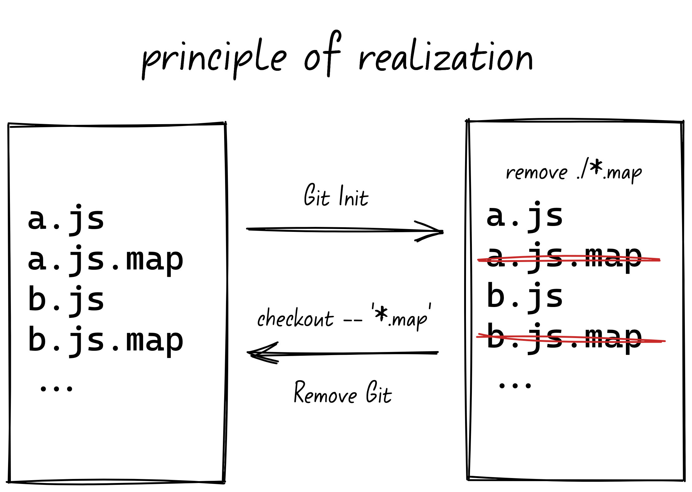

# Stash map files

> stash source-map files，and restore them when you need.



> NOTE!: This is to solve the inaccurate positioning of the source code of the [miniprogram devtools](https://developers.weixin.qq.com/miniprogram/dev/devtools/devtools.html) breakpoint debugging .

## Install

```bash
# npm
npm install -g stash-mapfile
# yarn
yarn global add stash-mapfile
# pnpm
pnpm add -g stash-mapfile
```

## Usage

### Clean

> Remove all mapfiles, can\`t be restore

```bash
stash-mapfile
# or
stash-mapfile clean
```

### Stash

> Stash all mapfiles, can be restore

```shell
stash-mapfile
```

### Restore

> Restore all mapfiles

```shell
stash-mapfile restore
```

## Development

### Local

```bash
pnpm start
```

### Link

```bash
1. pnpm dev

2. npm link # yalc publish
```

## License

MIT License Copyright 2022 [zhixiaoqiang](https://github.com/zhixiaoqiang)
